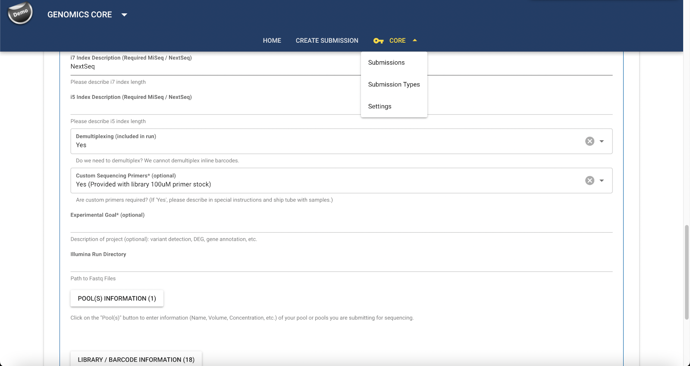

The CoreOmics sample submission system is a fully customizable application that lets every lab decide what information is important to them.  Whether providing services for high throughput sequencing, proteomics, metabolomics, or any other type of service, submission forms can be tailored to contain the specific information the lab needs to complete each project.

Providing a searchable database of submissions allows labs to keep all of their client interaction in one place.  Instead of dealing with a mess of emails and spreadsheets, labs can easily search through submissions, print samplesheets, message clients, update project statuses, etc.

Here is a list of some of the many features available:

- The CoreOmics submission system allows the lab to view and search all their submissions in one place:

    

- Clients have access to a simple web form, which is completely customizable, and can include typical form elements like inputs, radios, selects, etc, or more complex UI elements like tables for inputting samplesheets.

    
    

- Each submission has all of the information the lab needs in one place, such as contacts, submission details, charges, notes/messaging, etc.

    

- Each submission type is fully customizable.  Customizations include custom fields which can be basic form elements, complex tables, as well as numerous parameters for each such as widgets, validators, help text, etc.  Submission types can be configured with additional details like which lab members should be default participants, project id generation, help text, etc.

    
    

- Beyond submission types, labs have a number of other configuration options at their disposal.  They can create custom landing pages, libraries of fields for building consistent submission types, custom auto incrementing project ids, statuses, etc.  They can also control levels of access for lab members.
    

- Once a lab is setup to collect submissions through the sample submission system, they may even have access to the API.  The API can be used to automate lab workflows, or even let outside processes update project statuses.

    
